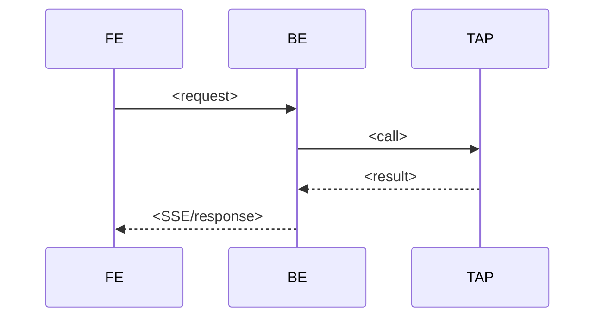

# <Flow>

> An ordered end-to-end sequence across components that realizes a feature. This
> is what makes a cross-stack feature legible: the exact hop-by-hop path.

## Sequence
<!-- Mirror the ordered `steps` above. One line per hop: node — what it does —
     what it passes on (real payload/event shape, recorded, not guessed). -->
1. [[cmp-<...>]] — <does X> → <passes Y>
2. [[cmp-<...>]] — …

## Failure modes
<!-- Where it breaks, what the user sees, where to look (obs trace). -->
