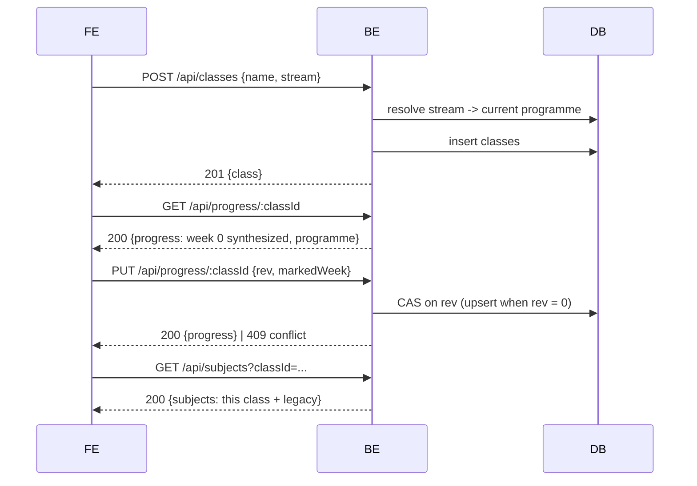

# Making a class, telling it where it is, and switching to it

## Sequence

1. [[cmp-fe-my-classes]] — a name and a stream, one create at a time, in order. (A brand-new
   account does the same thing on sign-up step 3 — [[cmp-fe-signup-classes]].)
2. [[cmp-be-classes-api]] — validates the stream against the programme corpus, inserts, logs
   `class.created` → `201 {class: {id, name, stream, createdAt}}`
3. [[cmp-fe-class-bar]] — the app re-reads the class list and every class's position; the bar
   appears as a new grid row. A class at week 0 shows its name alone
4. [[cmp-fe-class-position]] — selecting the class puts «أين وصل هذا القسم؟» on screen with a
   picker bounded by that class's own programme → `PUT {rev, markedWeek}`
5. [[cmp-be-progress-api]] — one atomic compare-and-set that also stamps the programme identity
   and inserts the document if it is the first write; logs `progress.write outcome:"win"` →
   `200 {progress}` (and no `programme`)
6. **Switching class** clears the desk — the open exam, the refine panel, the corrections — and
   re-reads the list scoped to the new class
7. [[cmp-be-subjects-api]] — `GET /api/subjects?classId=…` filters **in memory** through the
   legacy allow-list: this class's subjects **plus every subject stored before classes existed**
8. [[cmp-fe-subject-list]] — the sidebar renders the scoped list under the selected tab

## What the switch keeps and what it drops

Dropped: the open exam, the subject id, the refine panel, the corrections, the cached list.
Kept: an exam that failed to save and is queued for retry. Dropping that on a tab click would
be the silent loss the save queue exists to prevent, so it is a source comment as well as a
test. Also not cleared: the current error and busy flags.

**The switch is guarded by a monotonic ticket.** Two taps a render apart used to leave the last
*resolution* winning rather than the last *intent*, so class A's list could render under class
B's selected tab with the loading flag already false. A sequence number taken before the fetch
now gates the list, the list error **and** the loading flag — the third is not bookkeeping: a
superseded read clearing the flag is how a wrong screen stops looking busy. `teacher_required`
is deliberately outside the ticket, because it must always reach the gate.

## Failure modes

- **A lost race on step 5** — the second writer gets `409 conflict`, the surface re-reads and
  re-asks in Arabic, and the write is never resent. Both attempts leave a `progress.write` line;
  the loser's carries the rev it believed in. Correlate with `tools/obs trace <correlationId>`.
- **The class does not resolve** — `404 class_not_found`, byte-identical whether it never
  existed, belongs to another teacher, is malformed, or is the uppercase spelling of a real one.
- **The class list cannot be read** — no bar, no banner, nothing. A backend predating this slice
  answers 404 to every class call, and the app must boot clean against it.
- **The datastore is down** — `503 store_unavailable` on all four class and progress surfaces;
  the position surface says so in Arabic and offers a retry, keeping the chosen week.

## What this flow does not do

A generated exam carries **no** `classId`, so step 7 shows it under every class. That is the
current contract, not an oversight, and it is the first surprise a teacher meets here.
