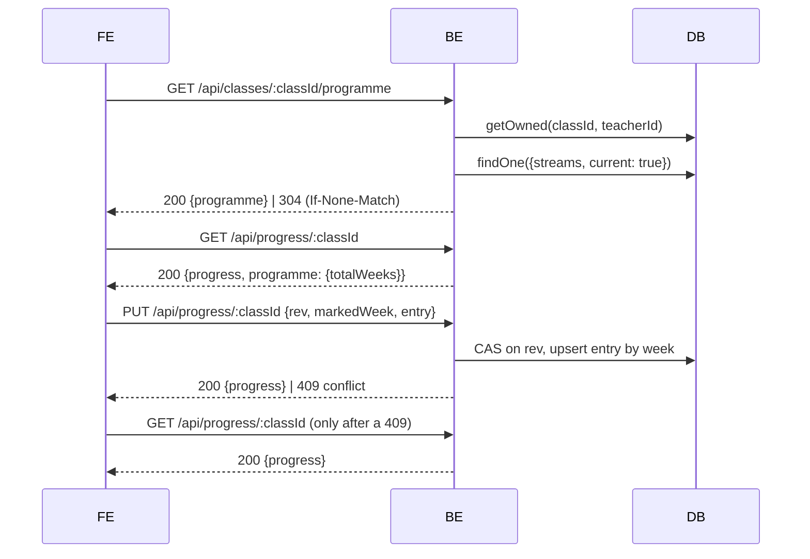

# Opening the tracker and marking a week done

## Sequence

1. [[cmp-fe-nav]] — a class is selected; the teacher taps «البرنامج». The view follows, and
   `#/programme` is written so refresh and Back land right
2. Two reads fire: `GET /api/classes/:classId/programme` and `GET /api/progress/:classId`.
   The programme is cached per class for the session
3. [[cmp-be-programme-api]] — `requireTeacher` → the id shape → `getOwned` → the class's own
   stream → the whitelist projection. No mutation-log line: it is a read
4. [[cmp-fe-programme-lib]] — the weeks become **unit runs** (15 on maths, from 14 units) and
   a track total of Σ `weeks[].hours`
5. [[cmp-fe-programme-bar]] — one segment per run, filled to the marked week
6. [[cmp-fe-tracker]] — 27 bands, all collapsed except the current one, scrolled to the mark
   on mount
7. The teacher taps «تمّ ✓» on the current band. That row's controls disable →
   `PUT /api/progress/:classId {rev, markedWeek: min(W+1, T), entry: {week: W, status: "done"}}`
8. [[cmp-be-progress-api]] — one atomic compare-and-set; the entry upserts by week;
   `completedAt` is stamped server-side; `progress.write outcome:"win"` is logged →
   `200 {progress}` and **no `programme`**
9. Four surfaces follow one write, from the same fresh position and the programme already
   held — no refetch: band W reads «منجز» and folds, band W+1 becomes current and opens, the
   bar's fill advances, hours-to-date moves, and [[cmp-fe-class-bar]]'s rail and tab label
   follow

Measured live: «تمّ ✓» on week 14 moved hours-to-date 98 → 105, the class rail 51.9% → 55.6%,
the tab from «أسبوع 14» to «أسبوع 15» and the bar's filled segments 8 → 9. One PUT, two
backend log lines, zero notices.

## The two week totals never swap

`progress.programme.totalWeeks` is the **write bound** — what week may be recorded.
`programme.totals.weeks` is the **ministry's summary table** — header copy. The same number in
every corpus document today, deliberately named apart. The tracker header reads the second and
clamps against the first, and both are pinned in one render at a 30-week bound against a
27-week document.

## Failure modes

- **`409 conflict`** — the position moved in another tab or on another device. The backend
  logs `outcome:"cas_loss"` with the rev the loser believed in. The host re-reads **once** and
  the **losing band** shows the fresh position and re-asks in Arabic. No banner, no
  auto-resubmit, other bands untouched. The tracker makes many small writes where slice 1 made
  one per session, so this is normal operation.
- **`503 store_unavailable`** — Arabic retry state on the screen that called; the nav selection
  stands. Recovery on retry, no reload.
- **`404 class_not_found`** on the programme read — this class is gone from this session:
  refetch the class list and drop the selection.
- **`be` down mid-write** — the failure renders inside the losing band, the position does not
  advance, and there is no phantom local state. The same tap succeeds after recovery.
- **A `be` without this route** — both screens degrade to «الصفحة غير موجودة» with a retry.
  The builder, the position card and progress writes keep working.

## What this flow does not do

Nothing here writes an `entry.note` — notes are rendered and never authored. Nothing generates
anything: «سلسلة الأسبوع» is absent by contract, not disabled. And a generated exam still
carries no `classId`, so the library beside these two per-class screens still shows every exam
under every class.

## Related
- [[flow-class-position-and-switch]] — the same write, from the position card on home
