<!-- GENERATED by `tools/docs-graph book` — do not edit. The written source is the node files under docs/; edit those and re-run. -->

## Exam builder

> The product a teacher opens.

### What it is (product view)
A tool for Algerian lycée mathematics teachers. The teacher describes the exam
they need, gets a full draft in Arabic with the maths properly typeset, reworks
any single exercise by saying what they want changed, and prints the result. The
value is time: an evening's work compressed into minutes.

### Composed of (services)
- [teacher-fe](../svc-teacher-fe.md) — everything the teacher sees
- [teacher-be](../svc-teacher-be.md) — the API and the generation

### Features
- [Generate a draft exam](../feat-exam-generation.md) — produce a draft exam from structured choices
- [Rework one exercise](../feat-exercise-refinement.md) — rework one exercise in the teacher's own words
- [Print the paper](../feat-exam-print.md) — a printable paper

### Boundaries
Mathematics only, and one stream's programme so far. Nothing student-facing.
No accounts, no saved library, no billing: a draft lives in the browser for the
session and is lost if it is cleared.

## Features

## Generate a draft exam

### Product behavior (what the user gets)
The teacher picks a topic from the programme, a difficulty, how many exercises and
how long the exam should be, and may add a sentence in their own words. They get a
complete paper in Arabic — titled, with the duration and total marks, and each
exercise carrying its own mark allocation and typeset maths.

Two behaviours a teacher will notice:

- **It takes about two minutes.** The wait shows elapsed time and can be cancelled.
- **It tells them when it changed their request.** Asking for a topic that is not
  confirmed in the programme does not produce off-syllabus questions; the exam
  explains that the topic was substituted and which ones were used instead.

Marks always add up to the stated total.

### Implementation parallel
| Node | Stack | Role |
|---|---|---|
| [Exam controls](../cmp-fe-controls.md) | fe | turns the teacher's choices into a request |
| [Generation endpoint](../cmp-be-generate-endpoint.md) | be | the route that serves it |
| [CLI runner](../cmp-be-claude-runner.md) | be | runs the generation, bounds and classifies it |
| [Exam generation capability](../cmp-be-skill-exam-subject.md) | be | produces the exam and honours the programme |
| [Exam view](../cmp-fe-exam-view.md) | fe | renders it, assumptions included |
| [Generating a draft exam](../flow-generate-exam.md) | — | the hop-by-hop path |

## Generating a draft exam

### Sequence
1. [Exam controls](../cmp-fe-controls.md) — the teacher's choices become a request
2. [Generation endpoint](../cmp-be-generate-endpoint.md) — receives it, checks the capability exists
3. [CLI runner](../cmp-be-claude-runner.md) — queues if busy, runs the CLI, bounds it
4. [Exam generation capability](../cmp-be-skill-exam-subject.md) — reads the programme if needed, writes the exam
5. [Exam view](../cmp-fe-exam-view.md) — typesets and displays it, assumptions included

### Notes
There is no streaming: the backend answers once, after roughly two minutes, so
the wait is shown as elapsed time rather than as progress the server reports.
Cancelling abandons the result; work already running server-side continues.

## Print the paper

### Product behavior (what the user gets)
The teacher prints the exam straight from the browser, to paper or to PDF. What
comes out is the paper the students receive: the title, the stream, the duration
and the total marks, then the exercises with their marks and typeset maths.

The controls, the buttons and the generator's notes are not printed — those are
for the teacher, not the class. Exercises are kept off page breaks. A4.

### Implementation parallel
| Node | Stack | Role |
|---|---|---|
| [Exam view](../cmp-fe-exam-view.md) | fe | the same view, under a print stylesheet |

## Rework one exercise

### Product behavior (what the user gets)
The teacher picks one exercise and says what they want changed, in Arabic and in
their own words — "غيّر الأرقام", "صعّبه شوية", or anything else. Shortcuts cover
the three common cases: change the values, change the difficulty, swap it for a
different exercise on the same topic.

**Only that exercise changes.** The rest of the paper is untouched, and its mark
allocation is preserved so the total still adds up. A refinement takes about a
minute and can be cancelled; if it fails, the existing draft survives.

This is the interaction the product exists for — a teacher will repeat it several
times on one paper.

### Implementation parallel
| Node | Stack | Role |
|---|---|---|
| [Refinement panel](../cmp-fe-refine.md) | fe | takes the instruction, replaces the exercise by id |
| [Generation endpoint](../cmp-be-generate-endpoint.md) | be | the route |
| [CLI runner](../cmp-be-claude-runner.md) | be | runs it |
| [Exercise refinement capability](../cmp-be-skill-refine-exercise.md) | be | rewrites the exercise, keeps its slot |
| [Exam view](../cmp-fe-exam-view.md) | fe | re-renders the paper |
| [Reworking one exercise](../flow-refine-exercise.md) | — | the hop-by-hop path |

## Reworking one exercise

### Sequence
1. [Refinement panel](../cmp-fe-refine.md) — the instruction, the exercise, and a summary of the others
2. [Generation endpoint](../cmp-be-generate-endpoint.md) — receives it
3. [CLI runner](../cmp-be-claude-runner.md) — runs it, about a minute
4. [Exercise refinement capability](../cmp-be-skill-refine-exercise.md) — rewrites the exercise, keeps id/marks/label
5. [Exam view](../cmp-fe-exam-view.md) — the exercise is replaced by id and the paper re-renders

### Notes
The frontend assembles the whole request; the backend does not know what an exam
is. Nothing is stored server-side, so each refinement carries the current exercise
with it — which is also why refinements compose naturally.

## Under the hood

| service | modules | components |
|---|---|---|
| [teacher-be](../svc-teacher-be.md) | Agent workspace, Claude Code CLI wrapper | CLI runner, Exam generation capability, Exercise refinement capability, Generation endpoint |
| [teacher-fe](../svc-teacher-fe.md) | Exam builder UI | Exam controls, Exam view, Refinement panel |

## Map

```mermaid
flowchart TD
  cmp_be_claude_runner["cmp-be-claude-runner"]
  cmp_be_generate_endpoint["cmp-be-generate-endpoint"]
  cmp_be_skill_exam_subject["cmp-be-skill-exam-subject"]
  cmp_be_skill_refine_exercise["cmp-be-skill-refine-exercise"]
  cmp_fe_controls["cmp-fe-controls"]
  cmp_fe_exam_view["cmp-fe-exam-view"]
  cmp_fe_refine["cmp-fe-refine"]
  feat_exam_generation["feat-exam-generation"]
  feat_exam_print["feat-exam-print"]
  feat_exercise_refinement["feat-exercise-refinement"]
  flow_generate_exam["flow-generate-exam"]
  flow_refine_exercise["flow-refine-exercise"]
  mod_be_agent_workspace["mod-be-agent-workspace"]
  mod_be_claude_wrapper["mod-be-claude-wrapper"]
  mod_fe_exam_builder["mod-fe-exam-builder"]
  prod_exam_builder["prod-exam-builder"]
  svc_teacher_be["svc-teacher-be"]
  svc_teacher_fe["svc-teacher-fe"]
  cmp_be_claude_runner -.-> mod_be_claude_wrapper
  cmp_be_generate_endpoint -->|depends_on| cmp_be_claude_runner
  cmp_be_generate_endpoint -.-> mod_be_claude_wrapper
  cmp_be_skill_exam_subject -.-> mod_be_agent_workspace
  cmp_be_skill_refine_exercise -.-> mod_be_agent_workspace
  cmp_fe_controls -.-> mod_fe_exam_builder
  cmp_fe_exam_view -.-> mod_fe_exam_builder
  cmp_fe_refine -->|depends_on| cmp_fe_exam_view
  cmp_fe_refine -.-> mod_fe_exam_builder
  feat_exam_generation -->|realized_by| cmp_be_claude_runner
  feat_exam_generation -->|realized_by| cmp_be_generate_endpoint
  feat_exam_generation -->|realized_by| cmp_be_skill_exam_subject
  feat_exam_generation -->|realized_by| cmp_fe_controls
  feat_exam_generation -->|realized_by| cmp_fe_exam_view
  feat_exam_generation -->|realized_by| flow_generate_exam
  feat_exam_generation -.-> prod_exam_builder
  feat_exam_print -->|realized_by| cmp_fe_exam_view
  feat_exam_print -.-> prod_exam_builder
  feat_exercise_refinement -->|realized_by| cmp_be_claude_runner
  feat_exercise_refinement -->|realized_by| cmp_be_generate_endpoint
  feat_exercise_refinement -->|realized_by| cmp_be_skill_refine_exercise
  feat_exercise_refinement -->|realized_by| cmp_fe_exam_view
  feat_exercise_refinement -->|realized_by| cmp_fe_refine
  feat_exercise_refinement -->|realized_by| flow_refine_exercise
  feat_exercise_refinement -.-> prod_exam_builder
  flow_generate_exam -->|step| cmp_be_claude_runner
  flow_generate_exam -->|step| cmp_be_generate_endpoint
  flow_generate_exam -->|step| cmp_be_skill_exam_subject
  flow_generate_exam -->|step| cmp_fe_controls
  flow_generate_exam -->|step| cmp_fe_exam_view
  flow_refine_exercise -->|step| cmp_be_claude_runner
  flow_refine_exercise -->|step| cmp_be_generate_endpoint
  flow_refine_exercise -->|step| cmp_be_skill_refine_exercise
  flow_refine_exercise -->|step| cmp_fe_exam_view
  flow_refine_exercise -->|step| cmp_fe_refine
  mod_be_agent_workspace -.-> svc_teacher_be
  mod_be_claude_wrapper -.-> svc_teacher_be
  mod_fe_exam_builder -.-> svc_teacher_fe
  prod_exam_builder -->|composed_of| svc_teacher_be
  prod_exam_builder -->|composed_of| svc_teacher_fe
  classDef fe fill:#B5D4F4,stroke:#185FA5,color:#042C53
  classDef be fill:#C0DD97,stroke:#3B6D11,color:#173404
  classDef ai fill:#CECBF6,stroke:#534AB7,color:#26215C
  classDef neutral fill:#ECEAE3,stroke:#888780,color:#2C2C2A
  class cmp_be_claude_runner,cmp_be_generate_endpoint,cmp_be_skill_exam_subject,cmp_be_skill_refine_exercise,cmp_fe_controls,cmp_fe_exam_view,cmp_fe_refine,feat_exam_generation,feat_exam_print,feat_exercise_refinement,flow_generate_exam,flow_refine_exercise,mod_be_agent_workspace,mod_be_claude_wrapper,mod_fe_exam_builder,prod_exam_builder,svc_teacher_be,svc_teacher_fe neutral
```

