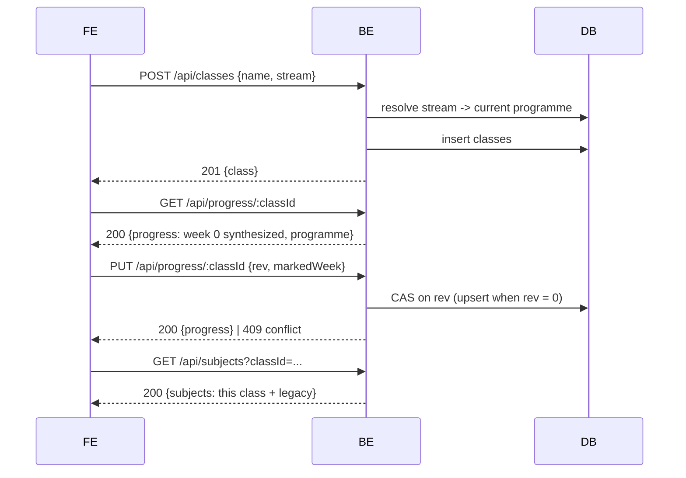

<!-- GENERATED by `tools/docs-graph book` — do not edit. The written source is the node files under docs/; edit those and re-run. -->

## Exam builder

> The product a teacher opens.

### What it is (product view)
A tool for Algerian lycée mathematics teachers. The teacher describes the exam
they need, gets a full draft in Arabic with the maths properly typeset, reworks
any single exercise by saying what they want changed, and prints the result. The
value is time: an evening's work compressed into minutes.

### Composed of (services)
- [teacher-fe](../svc-teacher-fe.md) — everything the teacher sees
- [teacher-be](../svc-teacher-be.md) — the API and the generation

### Features
- [Generate a draft exam](../feat-exam-generation.md) — produce a draft exam from structured choices
- [Rework one exercise](../feat-exercise-refinement.md) — rework one exercise in the teacher's own words
- [Print the paper](../feat-exam-print.md) — a printable paper
- [Keep every exam](../feat-subject-library.md) — every exam is kept and can be reopened
- [Going back to an earlier version of an exercise](../feat-exercise-history.md) — every superseded version is kept, and restorable
- [The correction a teacher keeps](../feat-solution-sheets.md) — the model correction and its grading scale
- [A teacher's exams follow them](../feat-teacher-accounts.md) — an account, so the exams follow the teacher
- [A teacher's classes, and where each one has reached](../feat-classes-progress.md) — the teacher's classes, and where each one has reached
- [Seeing the system you are running](../feat-admin-console.md) — the operator's view, not a teacher's

### Boundaries
Mathematics only. Six streams can be declared for a class and every one resolves to its
own programme document, but only شعبة الرياضيات has a curriculum reference for generation.
Nothing student-facing. There is billing for nobody. Exams are kept and now belong to an
account, but there is no search, no folders and no deleting — and a generated exam does not
yet know which class it was made for.

## Features

## Seeing the system you are running

### Product behavior (what the operator gets)

An **admin** account sees what no teacher can: every teacher, every exam, and four numbers
about the whole system — total exams, average generation time per exam, average exams per
teacher, and average **usage** per exam.

An admin reaches the console at `#/admin`. There is deliberately no link: any link a teacher
can see is an invitation to a request they will be refused, and the refusal is the only thing
they would learn.

### Every number says what it was computed over

This is the console's central discipline, learned the hard way.

- **`examsWithKpis`** — the averages for usage and duration cover only exams that carry those
  numbers. Everything generated before this shipped carries none, so an average without its
  denominator would be a number an operator acts on wrongly.
- **Teachers vs anonymous sessions** — the teacher count is **accounts**. Counting anonymous
  sessions too made *exams per teacher* read about three times low, because most rows in the
  store are sessions rather than people. Both figures are shown.
- **The teacher list is capped at 200 and says so**, reporting the true total. A truncated
  list that does not admit it is truncated is a lie.

### Usage is not money

The product runs on a subscription, so the per-exam figure is a **usage signal**, never a
price. It is labelled as consumption and never rendered with a currency symbol. Presenting
it as money would mislead the one person the console exists to inform.

### What an admin is not

An admin is **not a super-teacher.** On the ordinary teacher routes they see exactly their
own work — another teacher's exam is as invisible to them as it is to anyone. Privilege
lives on separate routes behind a separate guard, so there is no path where an ownership
check is "relaxed" for a role.

## A teacher's classes, and where each one has reached

### Product behavior (what the user gets)

A teacher tells the product which classes they teach — a name they already use
(«3ر1», «3ع2») and a stream for each — and then, per class, **where that class has
actually reached in the official programme**. A bar of tabs sits across the top of the
app, one tab per class, and the selected tab is the class everything else is about.

A class with no position says only its name. Selecting it puts one question on screen —
«أين وصل هذا القسم؟» — and a week picker running from 0 to that class's own last week.
Once a week is marked, the tab carries it («3ع2 · أسبوع 8») with a thin rail showing how
far through the programme that is.

Switching class empties the desk: the open exam, the refine panel and the corrections all
go, and the saved-exams list re-reads scoped to the new class. One thing deliberately
survives a switch — an exam that failed to save and is waiting to be retried. Dropping
that on a tab click would be exactly the silent loss the save queue exists to prevent.

New teachers meet classes during sign-up: after the recovery code, step 3 asks for the
classes and the school, step 4 asks where each one has reached, and every class on step 4
can be skipped. Everyone else — including every teacher who had an account before this
existed — adds classes from «أقسامي» in the account panel.

**Why per class and not per teacher.** A teacher with two classes three weeks apart has
two positions. Modelling them as one merges them silently, and the merge is discovered
when an exam covers material one class has never been taught, in front of that class.

### Implementation parallel

| Node | Stack | Role |
|---|---|---|
| [Class endpoints](../cmp-be-classes-api.md) | be | `POST`/`GET /api/classes` — create and list, stream validated against the corpus |
| [Progress endpoints](../cmp-be-progress-api.md) | be | `GET`/`PUT /api/progress/:classId` — the read synthesizes, the write compare-and-sets |
| [The teacher's school](../cmp-be-teacher-school.md) | be | `PUT /api/teacher/school` — collected on the same sign-up step |
| [Class and progress mutation log](../cmp-be-mutation-log.md) | be | one structured line per class or progress write, including the losses |
| [The class switcher](../cmp-fe-class-bar.md) | fe | the switcher row and its rails |
| [Where this class has reached](../cmp-fe-class-position.md) | fe | the week-0 invitation, the picker, and the 409 |
| [Sign-up steps 3 and 4](../cmp-fe-signup-classes.md) | fe | sign-up steps 3 and 4 |
| [«أقسامي» in the account panel](../cmp-fe-my-classes.md) | fe | «أقسامي» — the only path to a class for an existing account |
| [Making a class, telling it where it is, and switching to it](../flow-class-position-and-switch.md) | — | end-to-end: create → position → switch → re-scope |

The class layer also reaches into two nodes it does not own: [Subject store](../mod-be-subject-store.md) and
[Subject endpoints and teacher identity](../cmp-be-subjects-api.md), where a subject may carry a `classId` and a list may be filtered
by one, and [Teacher accounts store](../mod-be-teacher-store.md), which now holds the school.

### States & edges

- **No classes.** Every teacher who predates this is here. No bar, no position surface,
  no extra row in the shell — the app is byte-for-byte what it was. Verified against a
  recording of the pre-slice DOM.
- **Week 0.** Not an error and not a position. The tab shows the name alone; the surface
  asks the question.
- **A class whose position could not be read** looks the same as a genuine week-0 class in
  the bar, and gets **no** position surface. That is deliberate: a backend predating this
  slice answers 404 to every class call, and an error banner would greet every teacher on
  an older backend with a failure about a feature they are not using. The cost is a real
  ambiguity in the bar, recorded rather than papered over.
- **Two people writing one class's position at once.** One wins, the other gets a 409, is
  told «تغيّر موقع هذا القسم في مكان آخر… أعد الاختيار.», and the picker re-reads and
  re-asks. The write is never resent for them.
- **Datastore down.** The position write says so in Arabic and offers a retry, keeping the
  week the teacher chose. The class bar simply does not appear.

### Honest limits

- **A generated exam carries no `classId`.** It is stored as legacy, so an exam made while
  3ر1 was selected also appears under 3ت2. Deliberate — tagging generation is a later
  slice — and it is the first thing a teacher trying the switcher will notice.
- **The school is write-only.** It is stored and nothing reads it back, so «أقسامي» shows
  no school field. End to end it reads as "the setting does not work".
- **There is no delete, rename or archive** for a class, on any surface. A class made by
  mistake is permanent. A name made only of invisible characters (a pasted RLM or ZWSP)
  passes both stacks' `trim()` and produces a permanently blank tab — reproduced live.
- **`POST /api/classes` is not rate limited**, unlike the auth routes.
- **Per-week entries** (`planned · done · skipped` + a note) are stored and validated, but
  nothing in the UI writes one yet — only the marked week.
- **Nothing is auto-selected.** A teacher returning on a wiped browser gets their classes
  back with no tab selected, and a newly created class does not become the current one.

### Related
- [A teacher's exams follow them](../feat-teacher-accounts.md) — the account these hang off; sign-up steps 3 and 4 run after it
- [Keep every exam](../feat-subject-library.md) — the list a class switch re-scopes
- [Generate a draft exam](../feat-exam-generation.md) — does not yet know about classes

## Making a class, telling it where it is, and switching to it

### Sequence

1. [«أقسامي» in the account panel](../cmp-fe-my-classes.md) — a name and a stream, one create at a time, in order. (A brand-new
   account does the same thing on sign-up step 3 — [Sign-up steps 3 and 4](../cmp-fe-signup-classes.md).)
2. [Class endpoints](../cmp-be-classes-api.md) — validates the stream against the programme corpus, inserts, logs
   `class.created` → `201 {class: {id, name, stream, createdAt}}`
3. [The class switcher](../cmp-fe-class-bar.md) — the app re-reads the class list and every class's position; the bar
   appears as a new grid row. A class at week 0 shows its name alone
4. [Where this class has reached](../cmp-fe-class-position.md) — selecting the class puts «أين وصل هذا القسم؟» on screen with a
   picker bounded by that class's own programme → `PUT {rev, markedWeek}`
5. [Progress endpoints](../cmp-be-progress-api.md) — one atomic compare-and-set that also stamps the programme identity
   and inserts the document if it is the first write; logs `progress.write outcome:"win"` →
   `200 {progress}` (and no `programme`)
6. **Switching class** clears the desk — the open exam, the refine panel, the corrections — and
   re-reads the list scoped to the new class
7. [Subject endpoints and teacher identity](../cmp-be-subjects-api.md) — `GET /api/subjects?classId=…` filters **in memory** through the
   legacy allow-list: this class's subjects **plus every subject stored before classes existed**
8. [Saved exams list](../cmp-fe-subject-list.md) — the sidebar renders the scoped list under the selected tab

### What the switch keeps and what it drops

Dropped: the open exam, the subject id, the refine panel, the corrections, the cached list.
Kept: an exam that failed to save and is queued for retry. Dropping that on a tab click would
be the silent loss the save queue exists to prevent, so it is a source comment as well as a
test. Also not cleared: the current error and busy flags.

**The switch is guarded by a monotonic ticket.** Two taps a render apart used to leave the last
*resolution* winning rather than the last *intent*, so class A's list could render under class
B's selected tab with the loading flag already false. A sequence number taken before the fetch
now gates the list, the list error **and** the loading flag — the third is not bookkeeping: a
superseded read clearing the flag is how a wrong screen stops looking busy. `teacher_required`
is deliberately outside the ticket, because it must always reach the gate.

### Failure modes

- **A lost race on step 5** — the second writer gets `409 conflict`, the surface re-reads and
  re-asks in Arabic, and the write is never resent. Both attempts leave a `progress.write` line;
  the loser's carries the rev it believed in. Correlate with `tools/obs trace <correlationId>`.
- **The class does not resolve** — `404 class_not_found`, byte-identical whether it never
  existed, belongs to another teacher, is malformed, or is the uppercase spelling of a real one.
- **The class list cannot be read** — no bar, no banner, nothing. A backend predating this slice
  answers 404 to every class call, and the app must boot clean against it.
- **The datastore is down** — `503 store_unavailable` on all four class and progress surfaces;
  the position surface says so in Arabic and offers a retry, keeping the chosen week.

### What this flow does not do

A generated exam carries **no** `classId`, so step 7 shows it under every class. That is the
current contract, not an oversight, and it is the first surprise a teacher meets here.

## Generate a draft exam

### Product behavior (what the user gets)
The teacher picks a topic from the programme, a difficulty, how many exercises and
how long the exam should be, and may add a sentence in their own words. They get a
complete paper in Arabic — titled, with the duration and total marks, and each
exercise carrying its own mark allocation and typeset maths.

Two behaviours a teacher will notice:

- **It takes about two minutes.** The wait shows elapsed time and can be cancelled.
- **It tells them when it changed their request.** Asking for a topic that is not
  confirmed in the programme does not produce off-syllabus questions; the exam
  explains that the topic was substituted and which ones were used instead.

Marks always add up to the stated total.

### Implementation parallel
| Node | Stack | Role |
|---|---|---|
| [Exam controls](../cmp-fe-controls.md) | fe | turns the teacher's choices into a request |
| [Generation endpoint](../cmp-be-generate-endpoint.md) | be | the route that serves it |
| [CLI runner](../cmp-be-claude-runner.md) | be | runs the generation, bounds and classifies it |
| [Exam generation capability](../cmp-be-skill-exam-subject.md) | be | produces the exam and honours the programme |
| [Exam view](../cmp-fe-exam-view.md) | fe | renders it, assumptions included |
| [Generating a draft exam](../flow-generate-exam.md) | — | the hop-by-hop path |

## Generating a draft exam

### Sequence
1. [Exam controls](../cmp-fe-controls.md) — the teacher's choices become a request
2. [Progressive exam endpoint](../cmp-be-exams-endpoint.md) — receives it, checks the controls before spending anything
3. [Exam plan skill](../cmp-be-skill-exam-plan.md) — decides the skeleton: how many exercises, and each one's
   topic, points and difficulty. Roughly half a minute
4. The exam is **stored and answered here**, every slot waiting, points already summing to 20
5. [CLI runner](../cmp-be-claude-runner.md) — bounds how many exercises one exam may write at once
6. [One-exercise skill](../cmp-be-skill-exercise-one.md) — writes each exercise independently; each is stored the
   moment it is finished, guarded by [One writer at a time](../cmp-be-inflight.md)
7. [Exam view](../cmp-fe-exam-view.md) — re-reads the exam and typesets each exercise as it appears

### Notes
The teacher reads the exam while it is still being written. The first exercise has been
observed at roughly 68–91 seconds, against a complete exam at around two minutes — but that
range is a median, not a promise: identical work has been measured varying by a factor of 2.7,
so a given exercise may land anywhere in that spread.

**This is not faster.** The exam is finished when its slowest exercise is finished, so the
total is unchanged and can be slightly worse. What changed is when reading can start, and
what one bad exercise costs.

An exercise that cannot be produced is retried once, then marked as failed; the rest of the
exam stands and that one can be asked for again. Roughly one generation in twelve returns
something unusable, which under a single-run exam meant losing the whole thing.
Cancelling abandons the result; work already running server-side continues.

## Print the paper

### Product behavior (what the user gets)
The teacher prints the exam straight from the browser, to paper or to PDF. What
comes out is the paper the students receive: the title, the stream, the duration
and the total marks, then the exercises with their marks and typeset maths.

The controls, the buttons and the generator's notes are not printed — those are
for the teacher, not the class. Exercises are kept off page breaks. A4.

### Implementation parallel
| Node | Stack | Role |
|---|---|---|
| [Exam view](../cmp-fe-exam-view.md) | fe | the same view, under a print stylesheet |

## Going back to an earlier version of an exercise

### Product behavior (what the user gets)

Refining an exercise no longer throws the old one away. Every version a teacher moves
past is kept, newest first, and any of them can be put back on the sheet with one
action. The previous versions render like the exam does — through KaTeX, with the
maths set properly and never a line of LaTeX showing.

Restoring is not an undo that rewinds. It puts the chosen version back as the current
one and files the version it displaced alongside the rest, so the history only ever
grows. There is no sequence of actions that loses a version.

This matters more than it sounds. Refining until an exercise is right *is* the product,
and it is repeated several times per paper — so before this, the single most-used action
was also the only destructive one. Each discarded version is a complete, on-syllabus
exercise that cost real money to generate; they are also the raw material for the
personal exercise library on the roadmap.

### Behaviour under a double-tap

Two refinements of the same exercise arriving at once cannot lose one. The second is
either applied after the first or told plainly that the exercise is being edited — never
silently dropped. An exam with a single exercise behaves the same as one with many.

## Reworking one exercise

### Sequence
1. [Refinement panel](../cmp-fe-refine.md) — the instruction, the exercise, and a summary of the others
2. [Generation endpoint](../cmp-be-generate-endpoint.md) — receives it
3. [CLI runner](../cmp-be-claude-runner.md) — runs it, about a minute
4. [Exercise refinement capability](../cmp-be-skill-refine-exercise.md) — rewrites the exercise, keeps id/marks/label
5. [Exam view](../cmp-fe-exam-view.md) — the exercise is replaced by id and the paper re-renders

### Notes
The frontend assembles the whole request; the backend does not know what an exam
is: each refinement carries the current exercise with it, which is why refinements
compose naturally. The reworked exercise is then written back to the stored exam by
id — see [Saving an exam and reopening it later](../flow-save-and-reopen.md).

## Rework one exercise

### Product behavior (what the user gets)
The teacher picks one exercise and says what they want changed, in Arabic and in
their own words — "غيّر الأرقام", "صعّبه شوية", or anything else. Shortcuts cover
the three common cases: change the values, change the difficulty, swap it for a
different exercise on the same topic.

**Only that exercise changes.** The rest of the paper is untouched, and its mark
allocation is preserved so the total still adds up. A refinement takes about a
minute and can be cancelled; if it fails, the existing draft survives.

This is the interaction the product exists for — a teacher will repeat it several
times on one paper.

### Implementation parallel
| Node | Stack | Role |
|---|---|---|
| [Refinement panel](../cmp-fe-refine.md) | fe | takes the instruction, replaces the exercise by id |
| [Generation endpoint](../cmp-be-generate-endpoint.md) | be | the route |
| [CLI runner](../cmp-be-claude-runner.md) | be | runs it |
| [Exercise refinement capability](../cmp-be-skill-refine-exercise.md) | be | rewrites the exercise, keeps its slot |
| [Exam view](../cmp-fe-exam-view.md) | fe | re-renders the paper |
| [Reworking one exercise](../flow-refine-exercise.md) | — | the hop-by-hop path |

## Reworking one exercise

### Sequence
1. [Refinement panel](../cmp-fe-refine.md) — the instruction, the exercise, and a summary of the others
2. [Generation endpoint](../cmp-be-generate-endpoint.md) — receives it
3. [CLI runner](../cmp-be-claude-runner.md) — runs it, about a minute
4. [Exercise refinement capability](../cmp-be-skill-refine-exercise.md) — rewrites the exercise, keeps id/marks/label
5. [Exam view](../cmp-fe-exam-view.md) — the exercise is replaced by id and the paper re-renders

### Notes
The frontend assembles the whole request; the backend does not know what an exam
is: each refinement carries the current exercise with it, which is why refinements
compose naturally. The reworked exercise is then written back to the stored exam by
id — see [Saving an exam and reopening it later](../flow-save-and-reopen.md).

## The correction a teacher keeps

### Product behavior (what the user gets)

A teacher who has finished an exam can ask for its **correction**: a worked answer for every
exercise, and the **grading scale** (السلّم) saying how the marks break down inside it. It
prints as its own sheet — the exam goes to the class, the correction stays with the teacher.

The answers are worked rather than stated, because a teacher marks the method and not just
the final number, and each part of the scale names what is being marked so they can grade
straight down the page.

This was the most mechanical part of the evening the product had not touched. Writing an
exam takes judgement; the answers to it do not — they are determined by exercises that
already exist.

### Staleness — the part that makes it trustworthy

Refining an exercise leaves its correction answering a version the teacher no longer has.
That correction is **shown as out of date**, on screen and on paper. It is not deleted, and
it is never quietly served as current: a teacher hands a correction to a class, so a stale
one is worse than having none.

Only the exercise that changed goes stale — the rest stay current — and regenerating costs
just that one exercise rather than the whole paper. Restoring an exercise brings its
correction back to current on its own.

### Honest limits

**Nothing here checks that the mathematics is right.** What is checked is shape: an answer
for every exercise and no invented ones, a scale that sums exactly to the exercise's points,
Arabic throughout, and maths that renders. The teacher is the reviewer, and the product does
not pretend otherwise.

A correction is a second generation, and costs slightly **more** than the exam it corrects.
That is recorded against the exam so it stays answerable, and deliberately not metered.

## Generating a correction, and keeping it honest

### Sequence

1. **The teacher asks for the correction.** The frontend posts the stored exam to
   `/api/generate` with the `solution-sheet` skill — the same single spawn point exams use.
   ~145 s.
2. **The answers come back** with a scale per exercise. The frontend stamps each with the
   statement it was generated against, from the exam it just sent.
3. **It stores them** at `POST /api/subjects/:id/solutions`. The backend validates the whole
   batch before writing any of it, rejecting an unknown exercise id or a scale that does not
   sum to that exercise's points.
4. **Reading them back** recomputes staleness per exercise by hashing the exam as it is now.

### Why the backend stores rather than generates

It mirrors exams exactly, and it keeps **one** code path able to invoke the CLI — so the
concurrency cap and the failure classification keep their meaning. It also makes the storage
routes testable without paying for a generation.

### What a teacher sees when it goes wrong

Every message is Arabic. A datastore outage is retryable and says so; an expired CLI login is
not, because pressing the button again would be a lie. A correction answering a superseded
exercise is marked out of date rather than served as current — on screen and on paper.

## Keep every exam

### Product behavior (what the user gets)

Every exam a teacher generates is kept. Making a new one does not disturb the old
ones, and the list in the sidebar is the way back into any of them: open it, and it
is editable again exactly as it was — the same exercises, still refinable one by one.

Before this, the product held **one** exam at a time. Generating a second silently
destroyed the first, with no warning and no way back. Since an exam takes about two
minutes to generate and is then reworked by hand, that was the most expensive thing
the product could lose, and a teacher making their second exam of the trimester hit
it every time.

The teacher never signs in. Identity is handled invisibly, so nothing about this
asks them to make an account or remember anything.

When a save does not go through, the interface says so and offers to try again —
but only when trying again can actually help. A teacher must never be shown a
reassuring "saved" for work that was not.

### What it does not do yet

Exams are tied to the browser they were made in — there is no sign-in, so a
different device shows a different (empty) list. There is no search, no folders, and
nothing can be deleted.

### Implementation parallel
| Node | Stack | Role |
|---|---|---|
| [Saved exams list](../cmp-fe-subject-list.md) | fe | the list, its states, and the local migration |
| [Subject endpoints and teacher identity](../cmp-be-subjects-api.md) | be | the endpoints and the invisible identity |
| [Subject store](../mod-be-subject-store.md) | be | where exams are kept, and the insert-only rule |
| [Saving an exam and reopening it later](../flow-save-and-reopen.md) | — | the sequence end to end |

## Saving an exam and reopening it later

### Sequence

1. **First load** — the frontend asks for a teacher id if it has none and keeps it.
   Any exam left over from the old browser-only scheme is uploaded once here.
2. [Exam controls](../cmp-fe-controls.md) — the teacher sets what they want and generates
3. [Generation endpoint](../cmp-be-generate-endpoint.md) — produces the exam, unchanged by this feature
4. [Subject endpoints and teacher identity](../cmp-be-subjects-api.md) — the exam is stored as a **new** subject
5. [Subject store](../mod-be-subject-store.md) — inserted; earlier exams are untouched
6. [Saved exams list](../cmp-fe-subject-list.md) — it appears at the top of the list
7. **Later** — the teacher picks any earlier exam and it opens in full, refinable
   again. Reworking an exercise writes that exercise back to its stored exam.

### Notes

Generation itself is untouched by this flow — the exam is produced first and stored
afterwards, as a separate call. That is why the backend's generation surface did not
have to change, and why frontend and backend could ship in either order.

The list is ordered by when an exam was last *touched*, not created, so reworking an
old paper brings it back to the top.

## A teacher's exams follow them

### Product behavior (what the user gets)

A teacher signs up with an email and a password, and from then on their exams are
theirs. Clearing the browser no longer matters. Working from a second machine no
longer matters. They sign in and everything is there.

At sign-up they are shown a **recovery code** once — twelve characters in three
groups, `XXXX-XXXX-XXXX`, drawn from an alphabet with no `I`, `O`, `0` or `1` in it
because a teacher writes it on paper. It is the way back in if the password is
forgotten, and it is why the product needs no email delivery to be complete. Using it
sets a new password and hands out a **fresh** code in the same breath, so nobody is
ever left holding a code they have already spent.

Typing it back is forgiving: case does not matter and neither do the dashes, so
`abcd efgh ijkl` works as well as `ABCD-EFGH-IJKL`.

After the code, sign-up continues into two more screens — the teacher's classes and school,
then where each class has reached. See [A teacher's classes, and where each one has reached](../feat-classes-progress.md).

Before this, identity was invisible — the product minted a hidden id and kept it in
the browser. It worked until the browser was cleared, and then every exam that teacher
had ever made became unreachable. The documents survived; nothing could find them.
That is the failure this closes.

### What it deliberately does not do

- **Signing in does not merge an anonymous session.** If a browser was used without an
  account and then someone signs in, those earlier exams stay where they are — they are
  not moved into the account. The teacher is told so, in Arabic, and the previous
  identity is kept rather than discarded. Signing **up** from that browser *does* carry
  the exams across.
- **There is no sign-out**, and no "signed in as" indicator. Nobody has asked for one yet.

### Honest limits

The id behind an account is still a **bearer value**: whoever holds it can read that
teacher's exams — and now their classes and where each one has reached. Accounts made it
recoverable, not secret. It is accepted at the current milestone — two teacher friends
trying the product — and should not survive contact with real users at scale.

**Signing up for an address that already has an account no longer says so.** It answers
exactly like a first sign-up: `201`, a working teacher id, and a recovery code that is a
decoy. Nothing about the real account changes, and the duplicate simply creates no second
one. The cost is that a teacher who types an address they already used is left holding a
recovery code that cannot be redeemed, with nothing telling them why — and, if the browser
was not already carrying a known id, a fresh empty workspace. Traded for closing a
one-request way to test whether a colleague has an account.

The auth routes are rate limited (`429`, with a retry-after); the class routes are not.

## Signing up, signing in, and getting back in

### Sequence

1. **A browser with no identity** shows the gate. Nothing is minted silently and no
   request touches any teacher's data.
2. **Sign-up** sends the email and password — and, if this browser was already being
   used without an account, the id it holds. The server attaches the account to *that*
   id when it is unclaimed, so the exams already made here follow the teacher in.
   It answers with the teacher id and the recovery code, which is shown once.
3. **Sign-in** returns the *same* teacher id the account has always had. The browser
   stores it and asks for the teacher's subjects exactly as before — the subject
   routes never learned that accounts exist.
4. **Recovery** takes the email, the code and a new password. The code is spent and a
   fresh one is issued in the same response. Spending it twice fails; so does racing
   it, because the check and the write are one atomic step.

### Why it is shaped this way

The account **adopts** the opaque id rather than replacing it. That is what let the whole
feature ship without moving a single exam document, and it is why the sidebar, the
refine panel and the print sheet needed no change at all.

### What a teacher sees when it goes wrong

Every message is Arabic. A wrong password and an unknown address are answered
identically — the product will not tell a stranger which of their colleagues has an
account. A database outage is told apart from a bad password and offers a retry; a bad
password does not, because pressing the button again would be a lie.

## Under the hood

| service | modules | components |
|---|---|---|
| [teacher-be](../svc-teacher-be.md) | Admin and the auth boundary, Agent workspace, Class store, Claude Code CLI wrapper, Progress store, Exercise revision store, Correction store, Subject store, Teacher accounts store | Account endpoints, Admin surfaces and the privilege guard, CLI runner, Class and progress mutation log, Class endpoints, Exam generation capability, Exam plan skill, Exercise refinement capability, Generation endpoint, One writer at a time, One-correction skill, One-exercise skill, Per-exercise corrections, Progress endpoints, Progressive exam endpoint, Subject endpoints and teacher identity, The solution-sheet skill, The teacher's school |
| [teacher-fe](../svc-teacher-fe.md) | Exam builder UI | Exam controls, Exam view, Refinement panel, Saved exams list, Sign-up steps 3 and 4, The class switcher, The correction pane and its printed sheet, The operator's console, The sign-in gate, Where this class has reached, «أقسامي» in the account panel |

## Map

```mermaid
flowchart TD
  cmp_be_admin_api["cmp-be-admin-api"]
  cmp_be_auth_api["cmp-be-auth-api"]
  cmp_be_classes_api["cmp-be-classes-api"]
  cmp_be_claude_runner["cmp-be-claude-runner"]
  cmp_be_corrections_endpoint["cmp-be-corrections-endpoint"]
  cmp_be_exams_endpoint["cmp-be-exams-endpoint"]
  cmp_be_generate_endpoint["cmp-be-generate-endpoint"]
  cmp_be_inflight["cmp-be-inflight"]
  cmp_be_mutation_log["cmp-be-mutation-log"]
  cmp_be_progress_api["cmp-be-progress-api"]
  cmp_be_skill_exam_plan["cmp-be-skill-exam-plan"]
  cmp_be_skill_exam_subject["cmp-be-skill-exam-subject"]
  cmp_be_skill_exercise_one["cmp-be-skill-exercise-one"]
  cmp_be_skill_refine_exercise["cmp-be-skill-refine-exercise"]
  cmp_be_skill_solution_one["cmp-be-skill-solution-one"]
  cmp_be_skill_solution_sheet["cmp-be-skill-solution-sheet"]
  cmp_be_subjects_api["cmp-be-subjects-api"]
  cmp_be_teacher_school["cmp-be-teacher-school"]
  cmp_fe_admin_console["cmp-fe-admin-console"]
  cmp_fe_auth_panel["cmp-fe-auth-panel"]
  cmp_fe_class_bar["cmp-fe-class-bar"]
  cmp_fe_class_position["cmp-fe-class-position"]
  cmp_fe_controls["cmp-fe-controls"]
  cmp_fe_exam_view["cmp-fe-exam-view"]
  cmp_fe_my_classes["cmp-fe-my-classes"]
  cmp_fe_refine["cmp-fe-refine"]
  cmp_fe_signup_classes["cmp-fe-signup-classes"]
  cmp_fe_solution_view["cmp-fe-solution-view"]
  cmp_fe_subject_list["cmp-fe-subject-list"]
  feat_admin_console["feat-admin-console"]
  feat_classes_progress["feat-classes-progress"]
  feat_exam_generation["feat-exam-generation"]
  feat_exam_print["feat-exam-print"]
  feat_exercise_history["feat-exercise-history"]
  feat_exercise_refinement["feat-exercise-refinement"]
  feat_solution_sheets["feat-solution-sheets"]
  feat_subject_library["feat-subject-library"]
  feat_teacher_accounts["feat-teacher-accounts"]
  flow_class_position_and_switch["flow-class-position-and-switch"]
  flow_generate_correction["flow-generate-correction"]
  flow_generate_exam["flow-generate-exam"]
  flow_refine_exercise["flow-refine-exercise"]
  flow_save_and_reopen["flow-save-and-reopen"]
  flow_sign_in_and_recover["flow-sign-in-and-recover"]
  mod_be_admin["mod-be-admin"]
  mod_be_agent_workspace["mod-be-agent-workspace"]
  mod_be_class_store["mod-be-class-store"]
  mod_be_claude_wrapper["mod-be-claude-wrapper"]
  mod_be_progress_store["mod-be-progress-store"]
  mod_be_revision_store["mod-be-revision-store"]
  mod_be_solution_store["mod-be-solution-store"]
  mod_be_subject_store["mod-be-subject-store"]
  mod_be_teacher_store["mod-be-teacher-store"]
  mod_fe_exam_builder["mod-fe-exam-builder"]
  prod_exam_builder["prod-exam-builder"]
  svc_teacher_be["svc-teacher-be"]
  svc_teacher_fe["svc-teacher-fe"]
  cmp_be_admin_api -.-> mod_be_admin
  cmp_be_admin_api -->|depends_on| mod_be_teacher_store
  cmp_be_auth_api -->|depends_on| mod_be_teacher_store
  cmp_be_auth_api -.-> mod_be_teacher_store
  cmp_be_classes_api -->|depends_on| cmp_be_mutation_log
  cmp_be_classes_api -->|depends_on| mod_be_class_store
  cmp_be_classes_api -.-> mod_be_class_store
  cmp_be_classes_api -->|depends_on| mod_be_progress_store
  cmp_be_claude_runner -.-> mod_be_claude_wrapper
  cmp_be_corrections_endpoint -->|depends_on| cmp_be_claude_runner
  cmp_be_corrections_endpoint -->|depends_on| cmp_be_inflight
  cmp_be_corrections_endpoint -->|depends_on| cmp_be_skill_solution_one
  cmp_be_corrections_endpoint -.-> mod_be_claude_wrapper
  cmp_be_corrections_endpoint -->|depends_on| mod_be_solution_store
  cmp_be_exams_endpoint -->|depends_on| cmp_be_claude_runner
  cmp_be_exams_endpoint -->|depends_on| cmp_be_inflight
  cmp_be_exams_endpoint -->|depends_on| cmp_be_skill_exam_plan
  cmp_be_exams_endpoint -->|depends_on| cmp_be_skill_exercise_one
  cmp_be_exams_endpoint -.-> mod_be_claude_wrapper
  cmp_be_exams_endpoint -->|depends_on| mod_be_subject_store
  cmp_be_generate_endpoint -->|depends_on| cmp_be_claude_runner
  cmp_be_generate_endpoint -.-> mod_be_claude_wrapper
  cmp_be_inflight -.-> mod_be_claude_wrapper
  cmp_be_mutation_log -.-> mod_be_progress_store
  cmp_be_progress_api -->|depends_on| cmp_be_mutation_log
  cmp_be_progress_api -->|depends_on| mod_be_class_store
  cmp_be_progress_api -->|depends_on| mod_be_progress_store
  cmp_be_progress_api -.-> mod_be_progress_store
  cmp_be_skill_exam_plan -.-> mod_be_agent_workspace
  cmp_be_skill_exam_subject -.-> mod_be_agent_workspace
  cmp_be_skill_exercise_one -.-> mod_be_agent_workspace
  cmp_be_skill_refine_exercise -.-> mod_be_agent_workspace
  cmp_be_skill_solution_one -.-> mod_be_agent_workspace
  cmp_be_skill_solution_sheet -.-> mod_be_agent_workspace
  cmp_be_subjects_api -->|depends_on| mod_be_class_store
  cmp_be_subjects_api -->|depends_on| mod_be_subject_store
  cmp_be_subjects_api -.-> mod_be_subject_store
  cmp_be_teacher_school -->|depends_on| mod_be_teacher_store
  cmp_be_teacher_school -.-> mod_be_teacher_store
  cmp_fe_admin_console -->|depends_on| cmp_be_admin_api
  cmp_fe_admin_console -.-> mod_fe_exam_builder
  cmp_fe_auth_panel -->|depends_on| cmp_be_auth_api
  cmp_fe_auth_panel -.-> mod_fe_exam_builder
  cmp_fe_class_bar -->|depends_on| cmp_be_classes_api
  cmp_fe_class_bar -->|depends_on| cmp_be_progress_api
  cmp_fe_class_bar -.-> mod_fe_exam_builder
  cmp_fe_class_position -->|depends_on| cmp_be_progress_api
  cmp_fe_class_position -.-> mod_fe_exam_builder
  cmp_fe_controls -.-> mod_fe_exam_builder
  cmp_fe_exam_view -.-> mod_fe_exam_builder
  cmp_fe_my_classes -->|depends_on| cmp_be_classes_api
  cmp_fe_my_classes -->|depends_on| cmp_be_progress_api
  cmp_fe_my_classes -.-> mod_fe_exam_builder
  cmp_fe_refine -->|depends_on| cmp_fe_exam_view
  cmp_fe_refine -.-> mod_fe_exam_builder
  cmp_fe_signup_classes -->|depends_on| cmp_be_classes_api
  cmp_fe_signup_classes -->|depends_on| cmp_be_teacher_school
  cmp_fe_signup_classes -->|depends_on| cmp_fe_class_position
  cmp_fe_signup_classes -.-> mod_fe_exam_builder
  cmp_fe_solution_view -->|depends_on| mod_be_solution_store
  cmp_fe_solution_view -.-> mod_fe_exam_builder
  cmp_fe_subject_list -.-> mod_fe_exam_builder
  feat_admin_console -->|realized_by| cmp_be_admin_api
  feat_admin_console -->|realized_by| cmp_fe_admin_console
  feat_admin_console -->|realized_by| mod_be_teacher_store
  feat_admin_console -.-> prod_exam_builder
  feat_classes_progress -->|realized_by| cmp_be_classes_api
  feat_classes_progress -->|realized_by| cmp_be_mutation_log
  feat_classes_progress -->|realized_by| cmp_be_progress_api
  feat_classes_progress -->|realized_by| cmp_be_teacher_school
  feat_classes_progress -->|realized_by| cmp_fe_class_bar
  feat_classes_progress -->|realized_by| cmp_fe_class_position
  feat_classes_progress -->|realized_by| cmp_fe_my_classes
  feat_classes_progress -->|realized_by| cmp_fe_signup_classes
  feat_classes_progress -->|realized_by| flow_class_position_and_switch
  feat_classes_progress -.-> prod_exam_builder
  feat_exam_generation -->|realized_by| cmp_be_claude_runner
  feat_exam_generation -->|realized_by| cmp_be_exams_endpoint
  feat_exam_generation -->|realized_by| cmp_be_generate_endpoint
  feat_exam_generation -->|realized_by| cmp_be_inflight
  feat_exam_generation -->|realized_by| cmp_be_skill_exam_plan
  feat_exam_generation -->|realized_by| cmp_be_skill_exam_subject
  feat_exam_generation -->|realized_by| cmp_be_skill_exercise_one
  feat_exam_generation -->|realized_by| cmp_fe_controls
  feat_exam_generation -->|realized_by| cmp_fe_exam_view
  feat_exam_generation -->|realized_by| flow_generate_exam
  feat_exam_generation -.-> prod_exam_builder
  feat_exam_print -->|realized_by| cmp_fe_exam_view
  feat_exam_print -.-> prod_exam_builder
  feat_exercise_history -->|realized_by| cmp_be_subjects_api
  feat_exercise_history -->|realized_by| cmp_fe_refine
  feat_exercise_history -->|realized_by| flow_refine_exercise
  feat_exercise_history -->|realized_by| mod_be_revision_store
  feat_exercise_history -.-> prod_exam_builder
  feat_exercise_refinement -->|realized_by| cmp_be_claude_runner
  feat_exercise_refinement -->|realized_by| cmp_be_generate_endpoint
  feat_exercise_refinement -->|realized_by| cmp_be_skill_refine_exercise
  feat_exercise_refinement -->|realized_by| cmp_fe_exam_view
  feat_exercise_refinement -->|realized_by| cmp_fe_refine
  feat_exercise_refinement -->|realized_by| flow_refine_exercise
  feat_exercise_refinement -.-> prod_exam_builder
  feat_solution_sheets -->|realized_by| cmp_be_corrections_endpoint
  feat_solution_sheets -->|realized_by| cmp_be_inflight
  feat_solution_sheets -->|realized_by| cmp_be_skill_solution_one
  feat_solution_sheets -->|realized_by| cmp_be_skill_solution_sheet
  feat_solution_sheets -->|realized_by| cmp_fe_solution_view
  feat_solution_sheets -->|realized_by| flow_generate_correction
  feat_solution_sheets -->|realized_by| mod_be_solution_store
  feat_solution_sheets -.-> prod_exam_builder
  feat_subject_library -->|realized_by| cmp_be_subjects_api
  feat_subject_library -->|realized_by| cmp_fe_subject_list
  feat_subject_library -->|realized_by| flow_save_and_reopen
  feat_subject_library -.-> prod_exam_builder
  feat_teacher_accounts -->|realized_by| cmp_be_auth_api
  feat_teacher_accounts -->|realized_by| cmp_fe_auth_panel
  feat_teacher_accounts -->|realized_by| flow_sign_in_and_recover
  feat_teacher_accounts -->|realized_by| mod_be_teacher_store
  feat_teacher_accounts -.-> prod_exam_builder
  flow_class_position_and_switch -->|step| cmp_be_classes_api
  flow_class_position_and_switch -->|step| cmp_be_progress_api
  flow_class_position_and_switch -->|step| cmp_be_subjects_api
  flow_class_position_and_switch -->|step| cmp_fe_class_bar
  flow_class_position_and_switch -->|step| cmp_fe_class_position
  flow_class_position_and_switch -->|step| cmp_fe_my_classes
  flow_class_position_and_switch -->|step| cmp_fe_subject_list
  flow_generate_correction -->|step| cmp_be_corrections_endpoint
  flow_generate_correction -->|step| cmp_be_inflight
  flow_generate_correction -->|step| cmp_be_skill_solution_one
  flow_generate_correction -->|step| cmp_fe_solution_view
  flow_generate_correction -->|step| mod_be_solution_store
  flow_generate_exam -->|step| cmp_be_claude_runner
  flow_generate_exam -->|step| cmp_be_exams_endpoint
  flow_generate_exam -->|step| cmp_be_inflight
  flow_generate_exam -->|step| cmp_be_skill_exam_plan
  flow_generate_exam -->|step| cmp_be_skill_exercise_one
  flow_generate_exam -->|step| cmp_fe_controls
  flow_generate_exam -->|step| cmp_fe_exam_view
  flow_refine_exercise -->|step| cmp_be_claude_runner
  flow_refine_exercise -->|step| cmp_be_generate_endpoint
  flow_refine_exercise -->|step| cmp_be_skill_refine_exercise
  flow_refine_exercise -->|step| cmp_fe_exam_view
  flow_refine_exercise -->|step| cmp_fe_refine
  flow_save_and_reopen -->|step| cmp_be_generate_endpoint
  flow_save_and_reopen -->|step| cmp_be_subjects_api
  flow_save_and_reopen -->|step| cmp_fe_controls
  flow_save_and_reopen -->|step| cmp_fe_subject_list
  flow_save_and_reopen -->|step| mod_be_subject_store
  flow_sign_in_and_recover -->|step| cmp_be_auth_api
  flow_sign_in_and_recover -->|step| cmp_be_subjects_api
  flow_sign_in_and_recover -->|step| cmp_fe_auth_panel
  flow_sign_in_and_recover -->|step| mod_be_teacher_store
  mod_be_admin -.-> svc_teacher_be
  mod_be_agent_workspace -.-> svc_teacher_be
  mod_be_class_store -.-> svc_teacher_be
  mod_be_claude_wrapper -.-> svc_teacher_be
  mod_be_progress_store -.-> svc_teacher_be
  mod_be_revision_store -.-> svc_teacher_be
  mod_be_solution_store -.-> svc_teacher_be
  mod_be_subject_store -.-> svc_teacher_be
  mod_be_teacher_store -.-> svc_teacher_be
  mod_fe_exam_builder -.-> svc_teacher_fe
  prod_exam_builder -->|composed_of| svc_teacher_be
  prod_exam_builder -->|composed_of| svc_teacher_fe
  classDef fe fill:#B5D4F4,stroke:#185FA5,color:#042C53
  classDef be fill:#C0DD97,stroke:#3B6D11,color:#173404
  classDef ai fill:#CECBF6,stroke:#534AB7,color:#26215C
  classDef neutral fill:#ECEAE3,stroke:#888780,color:#2C2C2A
  class cmp_be_admin_api,cmp_be_auth_api,cmp_be_classes_api,cmp_be_claude_runner,cmp_be_corrections_endpoint,cmp_be_exams_endpoint,cmp_be_generate_endpoint,cmp_be_inflight,cmp_be_mutation_log,cmp_be_progress_api,cmp_be_skill_exam_plan,cmp_be_skill_exam_subject,cmp_be_skill_exercise_one,cmp_be_skill_refine_exercise,cmp_be_skill_solution_one,cmp_be_skill_solution_sheet,cmp_be_subjects_api,cmp_be_teacher_school,cmp_fe_admin_console,cmp_fe_auth_panel,cmp_fe_class_bar,cmp_fe_class_position,cmp_fe_controls,cmp_fe_exam_view,cmp_fe_my_classes,cmp_fe_refine,cmp_fe_signup_classes,cmp_fe_solution_view,cmp_fe_subject_list,feat_admin_console,feat_classes_progress,feat_exam_generation,feat_exam_print,feat_exercise_history,feat_exercise_refinement,feat_solution_sheets,feat_subject_library,feat_teacher_accounts,flow_class_position_and_switch,flow_generate_correction,flow_generate_exam,flow_refine_exercise,flow_save_and_reopen,flow_sign_in_and_recover,mod_be_admin,mod_be_agent_workspace,mod_be_class_store,mod_be_claude_wrapper,mod_be_progress_store,mod_be_revision_store,mod_be_solution_store,mod_be_subject_store,mod_be_teacher_store,mod_fe_exam_builder,prod_exam_builder,svc_teacher_be,svc_teacher_fe neutral
```

