<!-- GENERATED by `tools/docs-graph book` — do not edit. The written source is the node files under docs/; edit those and re-run. -->

## Exam builder

> The product a teacher opens.

### What it is (product view)
A tool for Algerian lycée mathematics teachers. The teacher describes the exam
they need, gets a full draft in Arabic with the maths properly typeset, reworks
any single exercise by saying what they want changed, and prints the result. The
value is time: an evening's work compressed into minutes.

### Composed of (services)
- [teacher-fe](../svc-teacher-fe.md) — everything the teacher sees
- [teacher-be](../svc-teacher-be.md) — the API and the generation

### Features
- [Generate a draft exam](../feat-exam-generation.md) — produce a draft exam from structured choices
- [Rework one exercise](../feat-exercise-refinement.md) — rework one exercise in the teacher's own words
- [Print the paper](../feat-exam-print.md) — a printable paper
- [Keep every exam](../feat-subject-library.md) — every exam is kept and can be reopened

### Boundaries
Mathematics only, and one stream's programme so far. Nothing student-facing.
No sign-in and no billing. Exams are kept, but they are tied to the browser they
were made in, and there is no search, no folders and no deleting.

## Features

## Generate a draft exam

### Product behavior (what the user gets)
The teacher picks a topic from the programme, a difficulty, how many exercises and
how long the exam should be, and may add a sentence in their own words. They get a
complete paper in Arabic — titled, with the duration and total marks, and each
exercise carrying its own mark allocation and typeset maths.

Two behaviours a teacher will notice:

- **It takes about two minutes.** The wait shows elapsed time and can be cancelled.
- **It tells them when it changed their request.** Asking for a topic that is not
  confirmed in the programme does not produce off-syllabus questions; the exam
  explains that the topic was substituted and which ones were used instead.

Marks always add up to the stated total.

### Implementation parallel
| Node | Stack | Role |
|---|---|---|
| [Exam controls](../cmp-fe-controls.md) | fe | turns the teacher's choices into a request |
| [Generation endpoint](../cmp-be-generate-endpoint.md) | be | the route that serves it |
| [CLI runner](../cmp-be-claude-runner.md) | be | runs the generation, bounds and classifies it |
| [Exam generation capability](../cmp-be-skill-exam-subject.md) | be | produces the exam and honours the programme |
| [Exam view](../cmp-fe-exam-view.md) | fe | renders it, assumptions included |
| [Generating a draft exam](../flow-generate-exam.md) | — | the hop-by-hop path |

## Generating a draft exam

### Sequence
1. [Exam controls](../cmp-fe-controls.md) — the teacher's choices become a request
2. [Generation endpoint](../cmp-be-generate-endpoint.md) — receives it, checks the capability exists
3. [CLI runner](../cmp-be-claude-runner.md) — queues if busy, runs the CLI, bounds it
4. [Exam generation capability](../cmp-be-skill-exam-subject.md) — reads the programme if needed, writes the exam
5. [Exam view](../cmp-fe-exam-view.md) — typesets and displays it, assumptions included

### Notes
There is no streaming: the backend answers once, after roughly two minutes, so
the wait is shown as elapsed time rather than as progress the server reports.
Cancelling abandons the result; work already running server-side continues.

## Print the paper

### Product behavior (what the user gets)
The teacher prints the exam straight from the browser, to paper or to PDF. What
comes out is the paper the students receive: the title, the stream, the duration
and the total marks, then the exercises with their marks and typeset maths.

The controls, the buttons and the generator's notes are not printed — those are
for the teacher, not the class. Exercises are kept off page breaks. A4.

### Implementation parallel
| Node | Stack | Role |
|---|---|---|
| [Exam view](../cmp-fe-exam-view.md) | fe | the same view, under a print stylesheet |

## Going back to an earlier version of an exercise

### Product behavior (what the user gets)

Refining an exercise no longer throws the old one away. Every version a teacher moves
past is kept, newest first, and any of them can be put back on the sheet with one
action. The previous versions render like the exam does — through KaTeX, with the
maths set properly and never a line of LaTeX showing.

Restoring is not an undo that rewinds. It puts the chosen version back as the current
one and files the version it displaced alongside the rest, so the history only ever
grows. There is no sequence of actions that loses a version.

This matters more than it sounds. Refining until an exercise is right *is* the product,
and it is repeated several times per paper — so before this, the single most-used action
was also the only destructive one. Each discarded version is a complete, on-syllabus
exercise that cost real money to generate; they are also the raw material for the
personal exercise library on the roadmap.

### Behaviour under a double-tap

Two refinements of the same exercise arriving at once cannot lose one. The second is
either applied after the first or told plainly that the exercise is being edited — never
silently dropped. An exam with a single exercise behaves the same as one with many.

## Reworking one exercise

### Sequence
1. [Refinement panel](../cmp-fe-refine.md) — the instruction, the exercise, and a summary of the others
2. [Generation endpoint](../cmp-be-generate-endpoint.md) — receives it
3. [CLI runner](../cmp-be-claude-runner.md) — runs it, about a minute
4. [Exercise refinement capability](../cmp-be-skill-refine-exercise.md) — rewrites the exercise, keeps id/marks/label
5. [Exam view](../cmp-fe-exam-view.md) — the exercise is replaced by id and the paper re-renders

### Notes
The frontend assembles the whole request; the backend does not know what an exam
is: each refinement carries the current exercise with it, which is why refinements
compose naturally. The reworked exercise is then written back to the stored exam by
id — see [Saving an exam and reopening it later](../flow-save-and-reopen.md).

## Rework one exercise

### Product behavior (what the user gets)
The teacher picks one exercise and says what they want changed, in Arabic and in
their own words — "غيّر الأرقام", "صعّبه شوية", or anything else. Shortcuts cover
the three common cases: change the values, change the difficulty, swap it for a
different exercise on the same topic.

**Only that exercise changes.** The rest of the paper is untouched, and its mark
allocation is preserved so the total still adds up. A refinement takes about a
minute and can be cancelled; if it fails, the existing draft survives.

This is the interaction the product exists for — a teacher will repeat it several
times on one paper.

### Implementation parallel
| Node | Stack | Role |
|---|---|---|
| [Refinement panel](../cmp-fe-refine.md) | fe | takes the instruction, replaces the exercise by id |
| [Generation endpoint](../cmp-be-generate-endpoint.md) | be | the route |
| [CLI runner](../cmp-be-claude-runner.md) | be | runs it |
| [Exercise refinement capability](../cmp-be-skill-refine-exercise.md) | be | rewrites the exercise, keeps its slot |
| [Exam view](../cmp-fe-exam-view.md) | fe | re-renders the paper |
| [Reworking one exercise](../flow-refine-exercise.md) | — | the hop-by-hop path |

## Reworking one exercise

### Sequence
1. [Refinement panel](../cmp-fe-refine.md) — the instruction, the exercise, and a summary of the others
2. [Generation endpoint](../cmp-be-generate-endpoint.md) — receives it
3. [CLI runner](../cmp-be-claude-runner.md) — runs it, about a minute
4. [Exercise refinement capability](../cmp-be-skill-refine-exercise.md) — rewrites the exercise, keeps id/marks/label
5. [Exam view](../cmp-fe-exam-view.md) — the exercise is replaced by id and the paper re-renders

### Notes
The frontend assembles the whole request; the backend does not know what an exam
is: each refinement carries the current exercise with it, which is why refinements
compose naturally. The reworked exercise is then written back to the stored exam by
id — see [Saving an exam and reopening it later](../flow-save-and-reopen.md).

## The correction a teacher keeps

### Product behavior (what the user gets)

A teacher who has finished an exam can ask for its **correction**: a worked answer for every
exercise, and the **grading scale** (السلّم) saying how the marks break down inside it. It
prints as its own sheet — the exam goes to the class, the correction stays with the teacher.

The answers are worked rather than stated, because a teacher marks the method and not just
the final number, and each part of the scale names what is being marked so they can grade
straight down the page.

This was the most mechanical part of the evening the product had not touched. Writing an
exam takes judgement; the answers to it do not — they are determined by exercises that
already exist.

### Staleness — the part that makes it trustworthy

Refining an exercise leaves its correction answering a version the teacher no longer has.
That correction is **shown as out of date**, on screen and on paper. It is not deleted, and
it is never quietly served as current: a teacher hands a correction to a class, so a stale
one is worse than having none.

Only the exercise that changed goes stale — the rest stay current — and regenerating costs
just that one exercise rather than the whole paper. Restoring an exercise brings its
correction back to current on its own.

### Honest limits

**Nothing here checks that the mathematics is right.** What is checked is shape: an answer
for every exercise and no invented ones, a scale that sums exactly to the exercise's points,
Arabic throughout, and maths that renders. The teacher is the reviewer, and the product does
not pretend otherwise.

A correction is a second generation, and costs slightly **more** than the exam it corrects.
That is recorded against the exam so it stays answerable, and deliberately not metered.

## Generating a correction, and keeping it honest

### Sequence

1. **The teacher asks for the correction.** The frontend posts the stored exam to
   `/api/generate` with the `solution-sheet` skill — the same single spawn point exams use.
   ~145 s.
2. **The answers come back** with a scale per exercise. The frontend stamps each with the
   statement it was generated against, from the exam it just sent.
3. **It stores them** at `POST /api/subjects/:id/solutions`. The backend validates the whole
   batch before writing any of it, rejecting an unknown exercise id or a scale that does not
   sum to that exercise's points.
4. **Reading them back** recomputes staleness per exercise by hashing the exam as it is now.

### Why the backend stores rather than generates

It mirrors exams exactly, and it keeps **one** code path able to invoke the CLI — so the
concurrency cap and the failure classification keep their meaning. It also makes the storage
routes testable without paying for a generation.

### What a teacher sees when it goes wrong

Every message is Arabic. A datastore outage is retryable and says so; an expired CLI login is
not, because pressing the button again would be a lie. A correction answering a superseded
exercise is marked out of date rather than served as current — on screen and on paper.

## Keep every exam

### Product behavior (what the user gets)

Every exam a teacher generates is kept. Making a new one does not disturb the old
ones, and the list in the sidebar is the way back into any of them: open it, and it
is editable again exactly as it was — the same exercises, still refinable one by one.

Before this, the product held **one** exam at a time. Generating a second silently
destroyed the first, with no warning and no way back. Since an exam takes about two
minutes to generate and is then reworked by hand, that was the most expensive thing
the product could lose, and a teacher making their second exam of the trimester hit
it every time.

The teacher never signs in. Identity is handled invisibly, so nothing about this
asks them to make an account or remember anything.

When a save does not go through, the interface says so and offers to try again —
but only when trying again can actually help. A teacher must never be shown a
reassuring "saved" for work that was not.

### What it does not do yet

Exams are tied to the browser they were made in — there is no sign-in, so a
different device shows a different (empty) list. There is no search, no folders, and
nothing can be deleted.

### Implementation parallel
| Node | Stack | Role |
|---|---|---|
| [Saved exams list](../cmp-fe-subject-list.md) | fe | the list, its states, and the local migration |
| [Subject endpoints and teacher identity](../cmp-be-subjects-api.md) | be | the endpoints and the invisible identity |
| [Subject store](../mod-be-subject-store.md) | be | where exams are kept, and the insert-only rule |
| [Saving an exam and reopening it later](../flow-save-and-reopen.md) | — | the sequence end to end |

## Saving an exam and reopening it later

### Sequence

1. **First load** — the frontend asks for a teacher id if it has none and keeps it.
   Any exam left over from the old browser-only scheme is uploaded once here.
2. [Exam controls](../cmp-fe-controls.md) — the teacher sets what they want and generates
3. [Generation endpoint](../cmp-be-generate-endpoint.md) — produces the exam, unchanged by this feature
4. [Subject endpoints and teacher identity](../cmp-be-subjects-api.md) — the exam is stored as a **new** subject
5. [Subject store](../mod-be-subject-store.md) — inserted; earlier exams are untouched
6. [Saved exams list](../cmp-fe-subject-list.md) — it appears at the top of the list
7. **Later** — the teacher picks any earlier exam and it opens in full, refinable
   again. Reworking an exercise writes that exercise back to its stored exam.

### Notes

Generation itself is untouched by this flow — the exam is produced first and stored
afterwards, as a separate call. That is why the backend's generation surface did not
have to change, and why frontend and backend could ship in either order.

The list is ordered by when an exam was last *touched*, not created, so reworking an
old paper brings it back to the top.

## A teacher's exams follow them

### Product behavior (what the user gets)

A teacher signs up with an email and a password, and from then on their exams are
theirs. Clearing the browser no longer matters. Working from a second machine no
longer matters. They sign in and everything is there.

At sign-up they are shown a **recovery code** once — twelve characters in three
groups, `XXXX-XXXX-XXXX`, drawn from an alphabet with no `I`, `O`, `0` or `1` in it
because a teacher writes it on paper. It is the way back in if the password is
forgotten, and it is why the product needs no email delivery to be complete. Using it
sets a new password and hands out a **fresh** code in the same breath, so nobody is
ever left holding a code they have already spent.

Typing it back is forgiving: case does not matter and neither do the dashes, so
`abcd efgh ijkl` works as well as `ABCD-EFGH-IJKL`.

Before this, identity was invisible — the product minted a hidden id and kept it in
the browser. It worked until the browser was cleared, and then every exam that teacher
had ever made became unreachable. The documents survived; nothing could find them.
That is the failure this closes.

### What it deliberately does not do

- **Signing in does not merge an anonymous session.** If a browser was used without an
  account and then someone signs in, those earlier exams stay where they are — they are
  not moved into the account. The teacher is told so, in Arabic, and the previous
  identity is kept rather than discarded. Signing **up** from that browser *does* carry
  the exams across.
- **There is no sign-out**, and no "signed in as" indicator. Nobody has asked for one yet.

### Honest limits

The id behind an account is still a **bearer value**: whoever holds it can read that
teacher's exams. Accounts made it recoverable, not secret. There is no rate limiting,
and sign-up answers differently for a taken address, so it is possible to test whether
an address has an account. All three are accepted at the current milestone — two teacher
friends trying the product — and none should survive contact with real users at scale.

## Signing up, signing in, and getting back in

### Sequence

1. **A browser with no identity** shows the gate. Nothing is minted silently and no
   request touches any teacher's data.
2. **Sign-up** sends the email and password — and, if this browser was already being
   used without an account, the id it holds. The server attaches the account to *that*
   id when it is unclaimed, so the exams already made here follow the teacher in.
   It answers with the teacher id and the recovery code, which is shown once.
3. **Sign-in** returns the *same* teacher id the account has always had. The browser
   stores it and asks for the teacher's subjects exactly as before — the subject
   routes never learned that accounts exist.
4. **Recovery** takes the email, the code and a new password. The code is spent and a
   fresh one is issued in the same response. Spending it twice fails; so does racing
   it, because the check and the write are one atomic step.

### Why it is shaped this way

The account **adopts** the opaque id rather than replacing it. That is what let the whole
feature ship without moving a single exam document, and it is why the sidebar, the
refine panel and the print sheet needed no change at all.

### What a teacher sees when it goes wrong

Every message is Arabic. A wrong password and an unknown address are answered
identically — the product will not tell a stranger which of their colleagues has an
account. A database outage is told apart from a bad password and offers a retry; a bad
password does not, because pressing the button again would be a lie.

## Under the hood

| service | modules | components |
|---|---|---|
| [teacher-be](../svc-teacher-be.md) | Agent workspace, Claude Code CLI wrapper, Exercise revision store, Correction store, Subject store, Teacher accounts store | Account endpoints, CLI runner, Exam generation capability, Exercise refinement capability, Generation endpoint, Subject endpoints and teacher identity, The solution-sheet skill |
| [teacher-fe](../svc-teacher-fe.md) | Exam builder UI | Exam controls, Exam view, Refinement panel, Saved exams list, The correction pane and its printed sheet, The sign-in gate |

## Map

```mermaid
flowchart TD
  cmp_be_auth_api["cmp-be-auth-api"]
  cmp_be_claude_runner["cmp-be-claude-runner"]
  cmp_be_generate_endpoint["cmp-be-generate-endpoint"]
  cmp_be_skill_exam_subject["cmp-be-skill-exam-subject"]
  cmp_be_skill_refine_exercise["cmp-be-skill-refine-exercise"]
  cmp_be_skill_solution_sheet["cmp-be-skill-solution-sheet"]
  cmp_be_subjects_api["cmp-be-subjects-api"]
  cmp_fe_auth_panel["cmp-fe-auth-panel"]
  cmp_fe_controls["cmp-fe-controls"]
  cmp_fe_exam_view["cmp-fe-exam-view"]
  cmp_fe_refine["cmp-fe-refine"]
  cmp_fe_solution_view["cmp-fe-solution-view"]
  cmp_fe_subject_list["cmp-fe-subject-list"]
  feat_exam_generation["feat-exam-generation"]
  feat_exam_print["feat-exam-print"]
  feat_exercise_history["feat-exercise-history"]
  feat_exercise_refinement["feat-exercise-refinement"]
  feat_solution_sheets["feat-solution-sheets"]
  feat_subject_library["feat-subject-library"]
  feat_teacher_accounts["feat-teacher-accounts"]
  flow_generate_correction["flow-generate-correction"]
  flow_generate_exam["flow-generate-exam"]
  flow_refine_exercise["flow-refine-exercise"]
  flow_save_and_reopen["flow-save-and-reopen"]
  flow_sign_in_and_recover["flow-sign-in-and-recover"]
  mod_be_agent_workspace["mod-be-agent-workspace"]
  mod_be_claude_wrapper["mod-be-claude-wrapper"]
  mod_be_revision_store["mod-be-revision-store"]
  mod_be_solution_store["mod-be-solution-store"]
  mod_be_subject_store["mod-be-subject-store"]
  mod_be_teacher_store["mod-be-teacher-store"]
  mod_fe_exam_builder["mod-fe-exam-builder"]
  prod_exam_builder["prod-exam-builder"]
  svc_teacher_be["svc-teacher-be"]
  svc_teacher_fe["svc-teacher-fe"]
  cmp_be_auth_api -->|depends_on| mod_be_teacher_store
  cmp_be_auth_api -.-> mod_be_teacher_store
  cmp_be_claude_runner -.-> mod_be_claude_wrapper
  cmp_be_generate_endpoint -->|depends_on| cmp_be_claude_runner
  cmp_be_generate_endpoint -.-> mod_be_claude_wrapper
  cmp_be_skill_exam_subject -.-> mod_be_agent_workspace
  cmp_be_skill_refine_exercise -.-> mod_be_agent_workspace
  cmp_be_skill_solution_sheet -.-> mod_be_agent_workspace
  cmp_be_subjects_api -->|depends_on| mod_be_subject_store
  cmp_be_subjects_api -.-> mod_be_subject_store
  cmp_fe_auth_panel -->|depends_on| cmp_be_auth_api
  cmp_fe_auth_panel -.-> mod_fe_exam_builder
  cmp_fe_controls -.-> mod_fe_exam_builder
  cmp_fe_exam_view -.-> mod_fe_exam_builder
  cmp_fe_refine -->|depends_on| cmp_fe_exam_view
  cmp_fe_refine -.-> mod_fe_exam_builder
  cmp_fe_solution_view -->|depends_on| mod_be_solution_store
  cmp_fe_solution_view -.-> mod_fe_exam_builder
  cmp_fe_subject_list -.-> mod_fe_exam_builder
  feat_exam_generation -->|realized_by| cmp_be_claude_runner
  feat_exam_generation -->|realized_by| cmp_be_generate_endpoint
  feat_exam_generation -->|realized_by| cmp_be_skill_exam_subject
  feat_exam_generation -->|realized_by| cmp_fe_controls
  feat_exam_generation -->|realized_by| cmp_fe_exam_view
  feat_exam_generation -->|realized_by| flow_generate_exam
  feat_exam_generation -.-> prod_exam_builder
  feat_exam_print -->|realized_by| cmp_fe_exam_view
  feat_exam_print -.-> prod_exam_builder
  feat_exercise_history -->|realized_by| cmp_be_subjects_api
  feat_exercise_history -->|realized_by| cmp_fe_refine
  feat_exercise_history -->|realized_by| flow_refine_exercise
  feat_exercise_history -->|realized_by| mod_be_revision_store
  feat_exercise_history -.-> prod_exam_builder
  feat_exercise_refinement -->|realized_by| cmp_be_claude_runner
  feat_exercise_refinement -->|realized_by| cmp_be_generate_endpoint
  feat_exercise_refinement -->|realized_by| cmp_be_skill_refine_exercise
  feat_exercise_refinement -->|realized_by| cmp_fe_exam_view
  feat_exercise_refinement -->|realized_by| cmp_fe_refine
  feat_exercise_refinement -->|realized_by| flow_refine_exercise
  feat_exercise_refinement -.-> prod_exam_builder
  feat_solution_sheets -->|realized_by| cmp_be_skill_solution_sheet
  feat_solution_sheets -->|realized_by| cmp_fe_solution_view
  feat_solution_sheets -->|realized_by| flow_generate_correction
  feat_solution_sheets -->|realized_by| mod_be_solution_store
  feat_solution_sheets -.-> prod_exam_builder
  feat_subject_library -->|realized_by| cmp_be_subjects_api
  feat_subject_library -->|realized_by| cmp_fe_subject_list
  feat_subject_library -->|realized_by| flow_save_and_reopen
  feat_subject_library -.-> prod_exam_builder
  feat_teacher_accounts -->|realized_by| cmp_be_auth_api
  feat_teacher_accounts -->|realized_by| cmp_fe_auth_panel
  feat_teacher_accounts -->|realized_by| flow_sign_in_and_recover
  feat_teacher_accounts -->|realized_by| mod_be_teacher_store
  feat_teacher_accounts -.-> prod_exam_builder
  flow_generate_correction -->|step| cmp_be_generate_endpoint
  flow_generate_correction -->|step| cmp_be_skill_solution_sheet
  flow_generate_correction -->|step| cmp_be_subjects_api
  flow_generate_correction -->|step| cmp_fe_solution_view
  flow_generate_correction -->|step| mod_be_solution_store
  flow_generate_exam -->|step| cmp_be_claude_runner
  flow_generate_exam -->|step| cmp_be_generate_endpoint
  flow_generate_exam -->|step| cmp_be_skill_exam_subject
  flow_generate_exam -->|step| cmp_fe_controls
  flow_generate_exam -->|step| cmp_fe_exam_view
  flow_refine_exercise -->|step| cmp_be_claude_runner
  flow_refine_exercise -->|step| cmp_be_generate_endpoint
  flow_refine_exercise -->|step| cmp_be_skill_refine_exercise
  flow_refine_exercise -->|step| cmp_fe_exam_view
  flow_refine_exercise -->|step| cmp_fe_refine
  flow_save_and_reopen -->|step| cmp_be_generate_endpoint
  flow_save_and_reopen -->|step| cmp_be_subjects_api
  flow_save_and_reopen -->|step| cmp_fe_controls
  flow_save_and_reopen -->|step| cmp_fe_subject_list
  flow_save_and_reopen -->|step| mod_be_subject_store
  flow_sign_in_and_recover -->|step| cmp_be_auth_api
  flow_sign_in_and_recover -->|step| cmp_be_subjects_api
  flow_sign_in_and_recover -->|step| cmp_fe_auth_panel
  flow_sign_in_and_recover -->|step| mod_be_teacher_store
  mod_be_agent_workspace -.-> svc_teacher_be
  mod_be_claude_wrapper -.-> svc_teacher_be
  mod_be_revision_store -.-> svc_teacher_be
  mod_be_solution_store -.-> svc_teacher_be
  mod_be_subject_store -.-> svc_teacher_be
  mod_be_teacher_store -.-> svc_teacher_be
  mod_fe_exam_builder -.-> svc_teacher_fe
  prod_exam_builder -->|composed_of| svc_teacher_be
  prod_exam_builder -->|composed_of| svc_teacher_fe
  classDef fe fill:#B5D4F4,stroke:#185FA5,color:#042C53
  classDef be fill:#C0DD97,stroke:#3B6D11,color:#173404
  classDef ai fill:#CECBF6,stroke:#534AB7,color:#26215C
  classDef neutral fill:#ECEAE3,stroke:#888780,color:#2C2C2A
  class cmp_be_auth_api,cmp_be_claude_runner,cmp_be_generate_endpoint,cmp_be_skill_exam_subject,cmp_be_skill_refine_exercise,cmp_be_skill_solution_sheet,cmp_be_subjects_api,cmp_fe_auth_panel,cmp_fe_controls,cmp_fe_exam_view,cmp_fe_refine,cmp_fe_solution_view,cmp_fe_subject_list,feat_exam_generation,feat_exam_print,feat_exercise_history,feat_exercise_refinement,feat_solution_sheets,feat_subject_library,feat_teacher_accounts,flow_generate_correction,flow_generate_exam,flow_refine_exercise,flow_save_and_reopen,flow_sign_in_and_recover,mod_be_agent_workspace,mod_be_claude_wrapper,mod_be_revision_store,mod_be_solution_store,mod_be_subject_store,mod_be_teacher_store,mod_fe_exam_builder,prod_exam_builder,svc_teacher_be,svc_teacher_fe neutral
```

